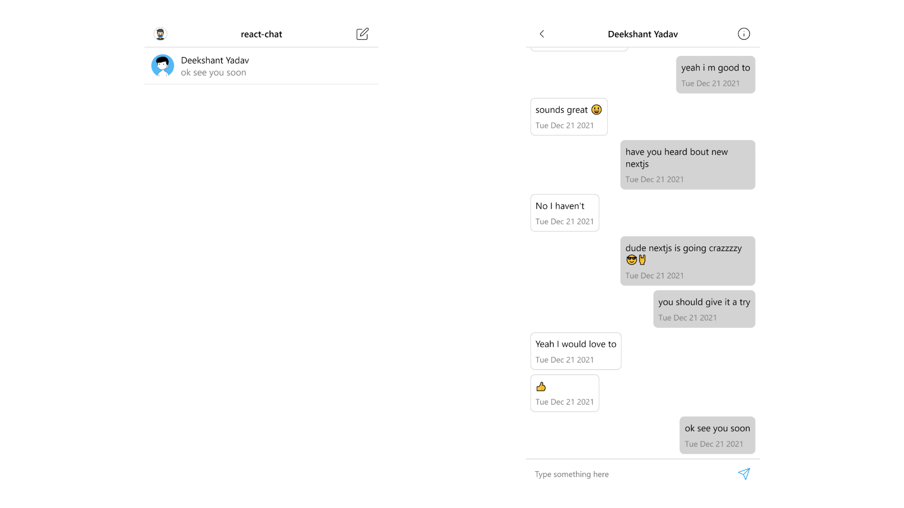

# react-chat-app
Simple chat app created with create-react-app deployed with firebase at [react-chats-dev.web.app](https://react-cahts-dev.web.app) where you can send and recive end to end text with your friend at real time. 

## Screenshot

## Features 
1. Realtime end to end chat.
2. Minimal instagram like UI with smooth animation.
3. Authantication with Google.
4. Native emoji support
5. Option to delete chats from both end.
